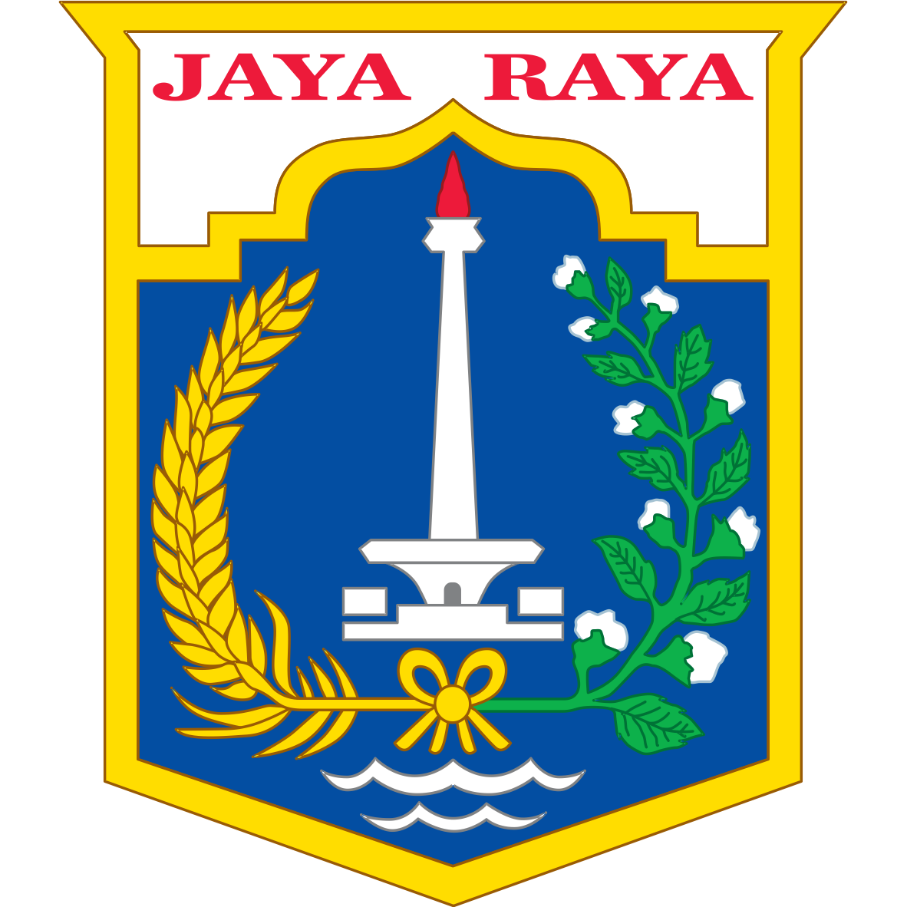
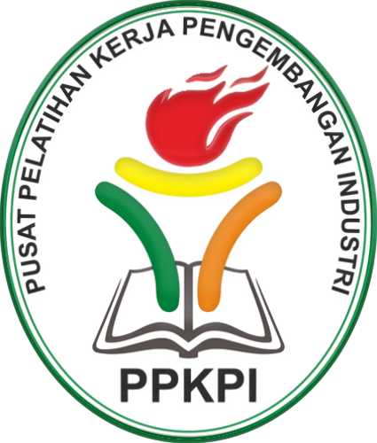

# 📚 Web Programming Bootcamp – PPKPI Jakarta (2025)

  
  

 

**This repository contains study materials and project assignments completed during the Web Programming Bootcamp at PPKPI Jakarta (Pusat Pelatihan Kerja Pengembangan Industri), a government-run vocational training center.**

---

## 📝 Bahasa Indonesia:

Repositori ini adalah arsip pembelajaran dan tugas proyek selama mengikuti pelatihan **Web Programming Bootcamp Angkatan II Tahun 2025** yang diselenggarakan oleh **PPKPI (Pusat Pelatihan Kerja Pengembangan Industri)**, sebuah lembaga resmi milik Pemerintah Provinsi DKI Jakarta.

Pelatihan berlangsung dari **19 Mei hingga 20 Agustus 2025** selama **480 jam pelajaran** (Senin–Jumat, kecuali hari libur). Program ini bertujuan mencetak tenaga kerja yang kompeten dan siap kerja di industri digital, khususnya dalam bidang pemrograman web.

Materi yang dipelajari meliputi:
- HTML5 & CSS3  
- JavaScript  
- PHP 
- Python 
- SQL

---

## 🗣 English:

This repository documents my learning journey and project assignments during the **2025 Web Programming Bootcamp (Batch II)** at **PPKPI (Center for Industrial Development Vocational Training)**, managed by the Jakarta Provincial Government.

The program ran from **May 19 to August 20, 2025**, for a total of **480 instructional hours**, held every **weekday (Monday to Friday, excluding national holidays)**. The bootcamp aimed to equip participants with practical skills for real-world web development jobs.

Technologies and concepts covered:
- HTML5 & CSS3  
- JavaScript  
- PHP  
- Python  
- SQL

---

## 🔧 Tech Stack Learned

- HTML & CSS  
- JavaScript  
- PHP (Native)  
- Python  
- SQL (MySQL)

---

## 🚀 About PPKPI

**PPKPI Jakarta** (Pusat Pelatihan Kerja Pengembangan Industri) is a government-supported training institution under the Department of Manpower and Transmigration of Jakarta. Its mission is to prepare job-ready professionals through certified, industry-aligned training programs.

Learn more: [disnakertransgi.jakarta.go.id](https://disnakertransgi.jakarta.go.id/unit-kerja/v/pusat-pelatihan-kerja-pengembangan-industri)

---

## 📌 Note

This repository serves as a personal portfolio to document my journey from beginner to aspiring software engineer through structured and practical training.
